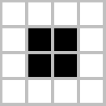
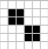
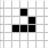

# Game of life simulation

## Also known as [Conway's Game of Life](https://en.wikipedia.org/wiki/Conway%27s_Game_of_Life) is a cellular automaton. It s a zero-player game and the changes are based on the initial state of game.

The universe of the Game of Life is an infinite, two-dimensional orthogonal grid of square cells, each of which is in one of two possible states, live or dead. Each subsequent generation is created based on a set of rules.

## Some Patterns

1. Still life :

2. Oscillator :

3. Glider :

## Some control options

- Clear screen
- Randomize living cells
- Pause Simulation
- Add a random pattern

## Tech used

- Vue3

- HTML Canvas for drawing and simulation pixel

- Vercel for CI/CD
     

[Deployment Link](https://game-of-life77.vercel.app)

